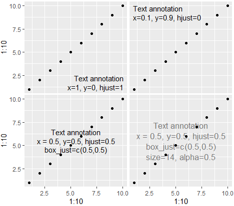

# lukesRlib <a href="https://lcpilling.github.io/lukesRlib/"></a>

My library of R functions I sometimes find useful

<!-- badges: start -->
[](https://github.com/lcpilling/lukesRlib)
[](https://github.com/lcpilling/lukesRlib/commits/master)
[](https://www.tidyverse.org/lifecycle/#experimental)
[](https://zenodo.org/badge/latestdoi/590063045)
<!-- badges: end -->

<sub>Toolbox icon from https://vectorified.com/icon-tool-box</sub>

## List of functions
  - [Hypothesis testing](#hypothesis-testing)
  - [Data Transformation](#data-transformation)
  - [Working with test statistics](#working-with-test-statistics)
  - [Plotting-related](#plotting-related)

## Installation
To install the development version from GitHub use the `remotes` package:

```r
remotes::install_github("lcpilling/lukesRlib")

remotes::install_github("lcpilling/lukesRlib@*release") # To install the latest release
remotes::install_github("lcpilling/lukesRlib@v0.2.0")   # To install a specific version (see tags)
```


## Hypothesis testing

### tidy_ci()
`tidy_ci()` ("tidy with CIs") runs [`broom::tidy()`](https://broom.tidymodels.org/) and returns the tidy estimates with CIs calculated as EST +/- 1.96*SE (i.e., the Wald method)

Motivation: by default the [{broom}](https://broom.tidymodels.org/) package uses `confint()` to estimate CIs. For GLMs this calculates CIs via the profile likelihood method. When using large datasets this takes a long time and does not meaningfully alter the CIs compared to calculating using 1.96*SE

`tidy_ci()` does a few other nice things: hides the intercept by default, automatically detects logistic/CoxPH/CRR models and exponentiates the estimates, and if p==0 returns the 'extreme p' as a string. Other options include -log10 p-values. See the [`tidy_ci()` Wiki](https://github.com/lcpilling/lukesRlib/wiki/tidy_ci()) page for more details 

#### Examples

```r
fit_linear = glm(bmi ~ age + sex, data = d)
tidy_ci(fit_linear)
#> Linear model (estimate=coefficient) :: N=449811 :: R2=0.0099
#> # A tibble: 2 x 8
#>   term  estimate std.error statistic   p.value conf.low conf.high p.extreme
#>   <chr>    <dbl>     <dbl>     <dbl>     <dbl>    <dbl>     <dbl> <chr>    
#> 1 age     0.0196  0.000847     23.1  4.72e-118   0.0179    0.0212 NA       
#> 2 sex     0.703   0.0137       51.4  0           0.676     0.729  9.39e-576
```

Provided N and R^2 estimate. Calculated "extreme p" where p rounded to 0

```r
library(survival)
fit_coxph = coxph(Surv(time, status) ~ age + sex + as.factor(smoking_status), data = d)
tidy_ci(fit_coxph)
#> CoxPH model (estimate=Hazard Ratio) :: N=449811, Nevents=31025
#> # A tibble: 4 x 8
#>   term             estimate std.error statistic  p.value conf.low conf.high
#>   <chr>               <dbl>     <dbl>     <dbl>    <dbl>    <dbl>     <dbl>
#> 1 age                 0.995  0.000837     -6.56 5.28e-11    0.993     0.996
#> 2 sex                 1.04   0.0109        3.66 2.52e- 4    1.02      1.06 
#> 3 smoking_status-1    1.04   0.0120        3.26 1.13e- 3    1.02      1.06 
#> 4 smoking_status-2    1.03   0.0149        2.16 3.08e- 2    1.00      1.06 
```

Automatically identified the input as from a coxph model and exponentiated estimate/CIs. Also provided N and Nevents. Also, tidied "as.factor()" variable names. If `haven::as_factor()` is used then any labels are shown correctly.


### get_assoc()

`get_assoc()` (phonetically: "get-a-sock") makes PheWAS in R easy and fast. It gets the tidy model output for categorical or continuous exposures, from linear, logistic, or CoxPH models. Output includes N and N cases, outcome, and model info. User can provide multiples exposures and outcomes. 

#### Example: Categorical exposure in logistic regression

```r
get_assoc(x="smoking_status", y="chd", z="+age", d=ukb, model="logistic", af=TRUE)
#> A tibble: 3 x 12
#>   outcome exposure               estimate std.error statistic p.value conf.low conf.high     n n_cases model   
#>   <chr>   <chr>                     <dbl>     <dbl>     <dbl>   <dbl>    <dbl>     <dbl> <dbl>   <dbl> <chr>   
#> 1 chd     smoking_status-Never       NA       NA         NA    NA        NA         NA    1073     146 logistic
#> 2 chd     smoking_status-Former      1.24     0.126      1.72  0.0852    0.970      1.59   918     180 logistic
#> 3 chd     smoking_status-Current     1.48     0.181      2.16  0.0311    1.04       2.11   285      52 logistic
```

The `estimate` is the Odds Ratio from a logistic regression model, and `n` and `n_cases` show the numbers for each category of the exposure (here `af=TRUE` i.e., treat as factor), including the reference group. Note that labels from `haven::labelled()` are shown correctly.

#### Example: Multiple exposures on single outcome (i.e., a "PheWAS")
```r
x_vars = c("bmi","ldl","sbp")
get_assoc(x=x_vars, y="chd", z="+age+sex", d=ukb, model="logistic")
#> # A tibble: 3 x 11
#>   outcome exposure estimate std.error statistic p.value conf.low conf.high     n n_cases model   
#>   <chr>   <chr>       <dbl>     <dbl>     <dbl>   <dbl>    <dbl>     <dbl> <int>   <int> <chr>   
#> 1 chd     bmi         1.08    0.0113      6.97  3.1e-12    1.06       1.11  4692     324 logistic
#> 2 chd     ldl         0.980   0.0689     -0.300 7.6e- 1    0.856      1.12  4498     311 logistic
#> 3 chd     sbp         1.01    0.00333     3.53  4.2e- 4    1.01       1.02  4561     316 logistic
```

Multiple exposures and outcomes can be provided simultaneously. Here, the exposures are continuous.

#### Example: stratified analyses
```r
res_all     = ukb |> 
                get_assoc(x=x_vars, y="chd", z="+age+sex", model="logistic", note="All")
res_males   = ukb |> 
                filter(sex=="Male") |> 
                get_assoc(x=x_vars, y="chd", z="+age", model="logistic", note="Males")
res_females = ukb |> 
                filter(sex=="Female") |> 
                get_assoc(x=x_vars, y="chd", z="+age", model="logistic", note="Females")

res = list_rbind(list(res_all, res_males, res_females))
```

Data is first argument. `get_assoc()` can be on the right-side of other `dplyr` functions. Stratified models can be therefore easily performed. The `note` argument means output is labelled and can be combined into a single data frame easily.


## Data Transformation

### carrec()

From [Steve Miller's package](https://github.com/svmiller/stevemisc): `carrec()` (phonetically: "car-wreck") is a port of `car::recode()` to avoid clashes in the {car} package. This offers STATA-like recoding features for R.

For example, if a variable of interest is on a 1-10 scale and you want to code values 6 and above to be 1, and code values of 1-5 to be 0, you would do:

```r
x = seq(1, 10)
x
#> [1]  1  2  3  4  5  6  7  8  9 10

carrec(x, "1:5=0;6:10=1")
#> [1] 0 0 0 0 0 1 1 1 1 1
```

### inv_norm()

Inverse (quantile) normalise a quantitative trait (vector) i.e., transform to a normal distribution with mean=0 and sd=1

```r
x_in = inv_norm(x)

df = df |> mutate(x_in = inv_norm(x))
```

### z_trans()

Z-transform a quantitative trait (vector) i.e., convert to mean=0 and sd=1, maintaining original distribution

```r
x_z = z_trans(x)

df = df |> mutate(x_z = z_trans(x))
```

## Working with test statistics

### get_se()

Calculate Standard Error from Confidence Intervals.  

```r
lci = 0.1
uci = 0.3

# Default denominator is (1.96*2) equivalent to 95% confidence (p<0.05)
get_se(lci, uci)
#>  [1] 0.05102041

# custom denominator e.g., if CIs correspond to a p-value 5*10-8
get_se(lci, uci, denominator=lukesRlib::get_z(5e-8)*2)   
#>  [1] 0.01834421
```


### get_z()

Return a Z-statistic from a given p-value

```r
p = 1e-10
get_z(p)
#>  [1] 6.466951
```


### get_p()

Return a p-value from a z (or t) statistic

```r
z = 10
get_p(z)
#>  [1] 1.523971e-23
```


### get_p_extreme()

Normally R will round numbers < 1*10-324 to zero. This function returns the "extreme p-value" as a string. Provide a z (or t) statistic

```r
z = 50
get_p_extreme(z)
#>  [1] "2.16e-545"
```


### get_p_neglog10()

Returns the -log10 p-value. Provide a z (or t) statistic

```r
z = 50
get_p_neglog10(z)
#>  [1] 544.6653
```


### get_p_neglog10_n()

Returns the -log10 p-value. Provide a z (or t) statistic and n (sample size)

```r
z = 50
n = 100000
get_p_neglog10_n(z, n)
#>  [1] 537.9851
```


## Plotting-related

### annotate_textp()

Annotate a ggplot2 plot with text. Allows one to specify the relative position of the figure easily. Configurable margin, text and box justification. The added bonus in the following code is that you can specify which facet to annotate with something like `facets=data.frame(cat1='blue', cat2='tall')`.

Function originally by Rosen Matev (from https://stackoverflow.com/questions/22488563/ggplot2-annotate-layer-position-in-r)

To get it aligned nicely in the middle, it may also require adjusting `box_just` depending on plot width etc. Other options include `size` and `alpha`

```r
qplot(1:10,1:10) + annotate_textp('Text annotation\nx=1, y=0, hjust=1', x=1, y=0, hjust=1)
qplot(1:10,1:10) + annotate_textp('Text annotation\nx=0.1, y=0.9, hjust=0', x=0, y=1, hjust=0)
qplot(1:10,1:10) + annotate_textp('Text annotation\nx = 0.5, y=0.5, hjust=0.5\nbox_just=c(0.5,0.5)', x=0.5, y=0.5, hjust=0.5, box_just=c(0.5,0.5))
qplot(1:10,1:10) + annotate_textp('Text annotation\nx = 0.5, y=0.5, hjust=0.5\nbox_just=c(0.5,0.5)\nsize=14, alpha=0.5', x=0.5, y=0.5, hjust=0.5, box_just=c(0.5,0.5), size=13, alpha=0.5)
```



### theme_minimal_modified()

Nice modification to ggplot's `theme_minimal` by Albert Rapp (https://alberts-newsletter.beehiiv.com/p/ggplot-theme)

```r
library(tidyverse)
penguins <- palmerpenguins::penguins |> 
  filter(!is.na(sex))

basic_plot <- penguins |> 
  ggplot(aes(x = bill_length_mm, y = body_mass_g, fill = species)) +
  geom_point(shape = 21, size = 5, alpha = 0.85, color = 'grey10') +
  labs(
    x = 'Bill length (in mm)',
    y = element_blank(),
    fill = 'Species',
    title = 'Penguins from the Palmer Archipelago',
    subtitle = 'Penguin weights (in g)',
    caption = 'Data: {palmerpenguins} R package'
  )

basic_plot +
  theme_minimal(base_size = 16, base_family = 'Source Sans Pro') +
  scale_fill_manual(values = c('Adelie'= '#da2c38', 'Chinstrap'= '#FED18C', 'Gentoo'= '#30C5FF')) +  # scale_fill_manual(values = thematic::okabe_ito(6)) +
  theme_minimal_modified()
```


